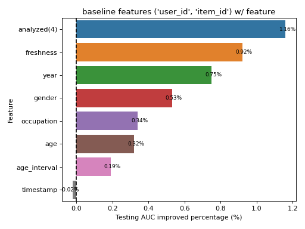

# Feature Analysis
The main purpose is to apply feature analysis techniques and feature selection process to choose features which shows strong impact on model training.

## Dataset
The dataset used in this repo is `MovieLens 100K Dataset`. The detail of the dataset could be found at [link](https://grouplens.org/datasets/movielens/100k/)

## Install
```shell
pip install -e .
```

## Feature Analysis process
Please follow the feature analysis process in [notebooks/feature_analysis.ipynb](./notebooks/feature_analysis.ipynb)

## Experiments
To reproduce result, type the following command on terminal
```console
python tools/train_hyperparams.py --config configs/hyperparams.yaml --log-dir logs
```

## Results
The conclusion of the analysis process, the most influential feature is `freshness` and the all 4 features `freshness`, `age`, `occupation`, and `gender` has their impacts on model performance. The result of testing AUC improved percentage is presented as:



## Citation
MovieLens 100K Dataset
```
F. Maxwell Harper and Joseph A. Konstan. 2015. The MovieLens Datasets: History and Context. ACM Transactions on Interactive Intelligent Systems (TiiS) 5, 4: 19:1–19:19. https://doi.org/10.1145/2827872
``` 
